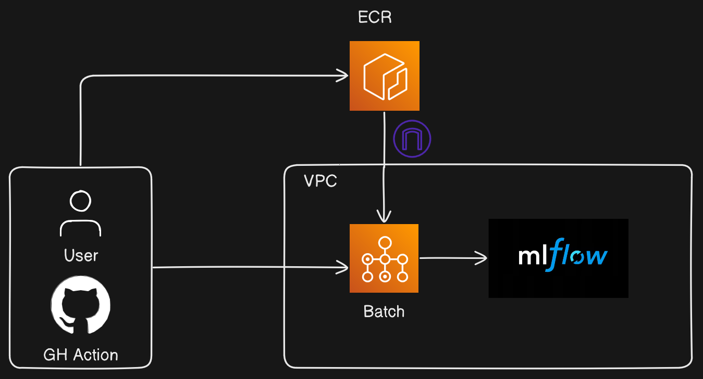

# Lean MLOps control centre with MLFlow + AWS + Terraform

This project allows you to manage the life cycle of your ML projects easily: train, track, deploy, monitor or retire your models in one line. Defining custom permissions, hardware resources, scaling policies and deployment strategies is also straightforward.

It uses MLFlow to track and containerise models, AWS services to productionise them, and Terraform to keep track of the infrastructure.

# Scope

It should work out of the box for models that can be trained in a single EC2 instance (up to a few hundred GBs of RAM usage, depending on instance type).

# Requirements

* GNU `make`

* Python 3

* Terraform 

* AWS CLI

* Docker (without `sudo`)

* Appropriate AWS permissions

# Workflow

Models are specified as MLProjects, and their life cycle is controlled through the project's Makefile, which calls Terraform to provision the MFLow server as well as training and deployment infrastructure. Available `make` rules are

```
deployment          Provisions model deployment infrastructure. Example use: make deployment project=test-project version=latest. 
deployment-rm       Tears down model deployment infrastructure. Example use: make deployment-rm project=test-project. 
help                Display this help message 
mlflow-server       Provisions the MLflow server infrastructure 
teardown            Tears down Terraform infrastructure 
training-infra      Provisions the training job pipeline infrastructure. Example use: make training-job project=test-project. 
training-infra-rm   Tears down the training job infrastructure. Example use: make training-job-rm project=test-project. 
training-job        Launches a training job, provisioning the infrastructure if needed. Example use: make training-job project=test-project
```

Use `make help` to see a list of up to date rules. See life cycle details below.

## MLFlow provisioning

This project uses [this Terraform module](https://github.com/nestorSag/terraform-aws-mlflow-server) to provision a production MLFlow server. Run `make mlflow-server` to start the process. The server architecture is shown below.


This server will register and containerise any models added to this platform. You can also use it as an experiment tracking platform.
The UI is accessible through a VPN, which is created and managed by Terraform as part of the platform. See the [repo](https://github.com/nestorSag/terraform-aws-mlflow-server) for access instructions.

## Integrating a new model

Add a new subfolder in the `ml-projects` folder sticking to the following constraints:

* Folders should be structured as valid [MLFlow projects](https://mlflow.org/docs/latest/projects.html).

* They should have an `MLProject` file specifying entry points and environment managers. Both `conda` and `venv` environment managers are supported.

* They should be runnable with `mlflow run` without passing any additional `-P` arguments; set defaults as needed.

* Your `MLProject` code is responsible for fetching the data (e.g. from S3), training the model and logging it to MLFlow along with any other artifacts; you can assume `MLFLOW_TRACKING_URI` will point to the provisioned server automatically. See the example included. Note even jupyter notebooks are fine, as long as they log the model as a valid [MLFlow Model](https://mlflow.org/docs/latest/models.html); this is straightforward to do for most ML libraries using the `mlflow` client library.


## Launching (re)training jobs

run `make training-job project=<my-project>`, where `my-project` is a subfolder in `ml-projects`. This will use Terraform to

1. Containerise your MLProject

2. Create an ECR for your container

3. Create AWS Batch compute environments in Fargate, along with a queue and task definitions.

Your training job will be launched on top of the above infrastructure. The end result is a new registered model in your MLFlow Registry (which your MLProject is assumed to handle internally, see [Integrating a new model](#integrating-a-new-model)), with name `<my-project>`. The MLFlow tracking URI is propagated automatically, do not hardcode it.



Note any uncommited changes in MLProjects with a deployed training job pipeline will trigger an image rebuild and reupload whenever a new training job is created, even if for a different MLProject, and could result in leaking uncommited code changes into your MLOps infrastructure. It is recommended that you [launch jobs through GitHub actions instead](#life-cycle-management-with-github-actions) to avoid this.

### Specifying computational requirements

You can create a `training-resource-requirements.json` file in `config/<my-project>/` with the following format to specify the computational requirements of your training job:

```json
[
    {"type": "VCPU", "value": "2"},
    {"type": "MEMORY", "value": "4096"},
    {"type": "GPU", "value": "1"}
]
```

The GPU line is optional, and you can remove it if your model does not use GPUs. If this file is not found, default values will be used. You must set your own defaults in Terraform variable `default_training_resource_requirements`.

### Permissions for training containers

The default IAM policies for training containers allows them to

* Read and write to any S3 bucket

* Read Parameter Store values with preffix `${var.project}/${var.region}/${var.env_name}`.  

* Read Secrets Store values with preffix `${var.project}/${var.region}/${var.env_name}`.

You can change it in `./terraform/defaults.tf`. 
Note the same IAM policies are used for all ML projects.

### Passing environment variables to training containers

`MLFLOW_TRACKING_URI` is the only environment variable passed to the batch job container when launched. If your container needs additional values, these will have to be fetched from the AWS Parameter Store or Secrets Store internally.

### Tearing down training job infrastructure

Training job infrastructure for a specific project can be tear down with `make training-infra-rm project=<my-project>`

## Launching deployment jobs 

run `make deployment project=<my-project> version=<my-version>`, where `my-project` is a subfolder in `ml-projects` and `<my-version>` is an available model version in the MLFlow Registry under the `<my-project>` name. This will use Terraform and MLFlow to

1. Continerise a specific model from the MLFlow Registry

2. Create an AWS SageMaker endpoint where the model is to be deployed

3. Create CloudWatch dashboards to track endpoint metrics, as well as model and data metrics.

### Endpoint and deployment configuration

You can create files `./config/<project>/endpoint-config.json` and `./config/<project>/deployment-config.json` to specify endpoint and deployment configuration for each project. Note they should mirror the resource structure for [`sagemaker_endpoint_configuration`](https://registry.terraform.io/providers/hashicorp/aws/latest/docs/resources/sagemaker_endpoint_configuration) and `sagemaker_endpoint`'s [DeploymentConfig](https://registry.terraform.io/providers/hashicorp/aws/latest/docs/resources/sagemaker_endpoint) respectively.

Both blue-green and rollout deployments are supported, but not all other parameters are. See the defaults included in this project at `./terraform/defaults.tf` to get an idea of supported parameter blocks. By default, the endpoints are serverless and use a blue-green deployment strategy.


### Data capture and async inference

Data capture and async inference are enabled and managed by default, and results are stored at buckt `s3://<TF_VAR_project>-<TF_VAR_envname>-sagemaker-endpoint-store` and folders `data_capture` and `async_inference` respectively. You can change data capture configuration in `./terraform/defaults.tf`.

### Deployment image

The deployment image is the one provided by default by MLFlow


### Tearing down deployment job infrastructure

Deployment job infrastructure for a specific project can be tear down with `make deployment-rm project=<my-project>`

## Model monitoring


# Life cycle management with GitHub actions

Every step of the workflow above can be performed by manually launching GitHub action workflows. This has the advantage of preventing uncommited code leaks into your model life cycle, and setting clear permissions boundaries for who can launch what kind of job.

## Teardown

running `make teardown` will delete all of the infrastructure in this project. It is encouraged to use this command instead of directly calling `terraform destroy`, because some parameters in the Parameter Store are not managed by Terraform, and to avoid some Terraform bugs when attempting to delete AWS Batch compute environments.

# Getting started

Whether your launch environment is your local machine or GitHub Actions, you will need to

1. Define the following environment variables

```sh
export TF_VAR_state_bucket_name=<my-bucket>
export TF_VAR_region=<my-region>
export TF_VAR_project=<my-project>
export TF_VAR_env_name=<my-env>
```

`TF_VAR_state_bucket_name` holds the S3 bucket with the global Terraform state. This is needed for GitHub Actions to work, and also if multiple people can launch jobs. In the latter case, it is recommended to set a Terraform state lock table as well.

2. Set up a Python virtual environment and install the `requirements.txt` file

3. Make sure your AWS CLI is configured appropriately

4. Mofidy file `./terraform/terraform.tfvars` and set appropriate values for your project.

5. As long as you have the necessary AWS permissions, you can provision the MLFlow server at this point running `make mlflow-server`.

6. Review the default permissions and configuration at `./terraform/defaults.tf` before launching any training or deployment jobs.

6. If you need to access the UI, [set up the server's VPN locally](https://github.com/nestorSag/terraform-aws-mlflow-server).

7. You are ready to go 🚀 you can use the `test-project` subfolder in this repository to try provisioning training and deployment pipelines.

8. Add model-specific configuration at `./config/<ml-project>` to control permissions, hardware resources and endpoint configurations for individual ML projects.

⚠️ Keep in mind this project requires broad permissions across multiple services such as ECS, S3, VPC, Batch, RDS, SageMaker, among others.

⚠️ This project uses billable services.


# Notes

* At this time, The support for the MLFlow server's metadata DB is limited to MySQL 8.0

* This project does not implement shadow deployment at this time.