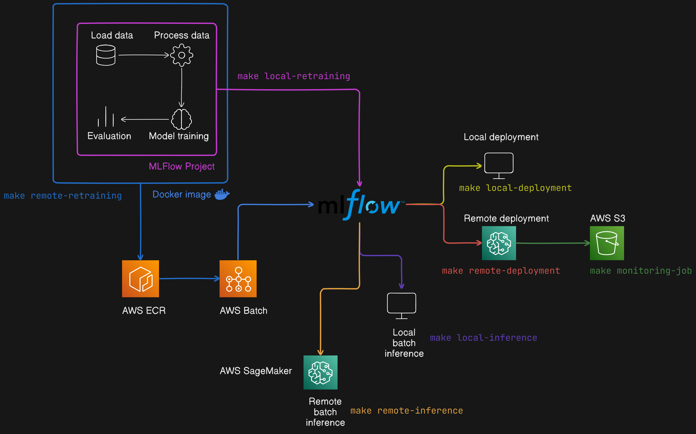

# MLOps template: MLFlow + AWS SageMaker

This project is a template for an MLOps platform that retrains, deploys and invokes ML models both locally and remotely using MLFlow and AWS SageMaker. 

It contains a base MLFlow project that runs the main ML pipeline when executed, from fetching the data to logging results in MLFlow. A remote MLFlow server acts as the control centre, and the model life cycle is orchestrated through Makefile entry points.

The main components are

* **MLFlow project** (`project/`): This project contains Python code to fech and preprocess data, train the model, evaluate it and log it to MLFLow. Replace the Python file contents as needed, or add a new project.

* **Terraform's MLFlow server** (`tf/`): If you don't yet have an MLFlow server up and running, use this project to bootstrap one using AWS infrastructure.

* `Makefile`: This file contains entry points to control the model's life cycle. Use `make` to see more details. Current options are 

```
mlflow-server       Bootstraps the MLflow server using the Terraform configuration in tf/ 

mlflow-server-rm    Destroys the MLflow server created with the Terraform configuration in tf/ 

local-batch-inference Runs a batch inference job locally, using .csv inputs and outputs. Pass --model-name and --model-version to specify the model to deploy from the MLFlow registry. 

local-deployment    Deploys the model to a local endpoint using MLFLow. Pass --model-name and --model-version to specify the model to deploy from the MLFlow registry. 

local-training      Re-runs the MLFlow project job locally and creates a new version of the model in the MLFlow registry. 


remote-batch-inference Runs a batch inference job remotely, using .csv inputs and outputs. Pass --model-name and --model-version to specify the model to use from the MLFlow registry. 

remote-deployment   Deploys the model to a SageMaker endpoint using MLFLow. Pass --model-name and --model-version to specify the model to use from the MLFlow registry. 

remote-training     Re-runs the containerised MLFlow project job in AWS and creates a new version of the model in the MLFlow registry. 

monitoring-job      Starts a monitoring job on a SageMaker endpoint.
```

## Template architecture 



## Set up

This project was built with Python `3.12.6`, Terraform `1.9.6` and AWS CLI `1.22.34`

## Setting up the MLFlow server

If you already have an MLFlow server, set `MLFLOW_TRACKING_URI` to your server's address. If not, use the Terraform project to start one up in AWS. You will need to:

1. Install AWS CLI

2. Set up appropriate AWS credentials through the CLI

3. Install Terraform

4. Create an S3 bucket to store Terraform's state. 

5. Set `TERRAFORM_BUCKET` to `s3://my-bucket-name`

## Running remote retraining, deployment or batch inference

You need steps 1. and 2. in the previous section.

## Launching remote retraining or deployment from GitHub Actions

There are GH Actions workflows in the repository that can be manually run to do this. The advantage of this approach is that it guarantees retrained and deployed models do not have untracked changes.