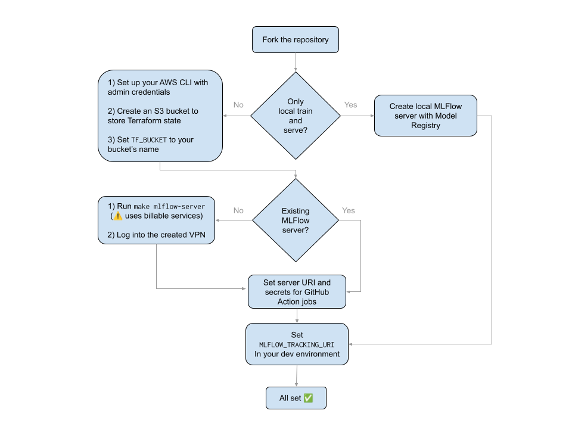

# MLOps control centre with MLFlow + AWS SageMaker

This project is intended to provide a minimal MLOps control centre to train, track, deploy, monitor and retire ML models using MLFlow and AWS SageMaker. 

# Scope

This project should work out of the box for tabular models trained on data sets that fit into a single EC2 instance (up to several hundred GBs of RAM, depending on instance size). 

# Assumptions

Models should be packaged in the form of valid [MLFlow projects](https://mlflow.org/docs/latest/projects.html). It is assumed that in the project folder, there is a `data.py` module with a function with the following signature

```py
def get_data() -> t.Tuple[t.Any, t.Any]
# usage: 
# X, y = get_data()
# model.fit(X, y)
```

this function does not take arguments. This means it is assumed that it always fetches valid, recent training data. Any necessary data processing pipelines for this to work are out of the scope of this repository.

# Usage

This repository is intended to be forked and used as a control centre for ML operations, through pull requests and GitHub Actions jobs. A Makefile also exposes rules to manage model life cycle from a local environment.


## Adding a model

When a model graduates from the experimentation stage, it can be added to the repository through a pull request, in the form of a new MLFlow Project folder. In order to validate the model by testing local training and serving, the following is expected:

1. There is a `data.py` in the MLFlow Project with a `get_data()` function with which the model fetches training data, and outputs a tuple of objects `X, y` for the model to be fitted (see `test-project/`).

2. `get_data()` should output a testing slice of the data whenever `TEST_ENV=True`. Model registration should be skipped in this case too.

## Model deployment

Model deployment can be triggered from the local development environment using `make` rules, or by triggering a GitHub actions job. The latter is recommended to avoid uncommited code leaking into deployed models.

When a model is deployed, an [AWS SageMaker endpoint](https://docs.aws.amazon.com/sagemaker/latest/dg/realtime-endpoints.html) is created for live scoring. This can be used for batch prediction as well.

## Model monitoring

Whenever a model is deployed, monitoring dashboards are created in AWS CloudWatch to keep track of the endpoint's performance and statistics. This includes

* Infrastructure metrics dashboard with number of requests, RAM usage and latency

* Statistics dashboard with input and output trends over time. 

The dashboard names are `<project-name>_stats` and `<project-name>_metrics`.

## Model decomissioning or rollback

Use `make` rules to deploy a different version of the model from MLFlow Model Registry into the SageMaker endpoint. Use the MLFlow Model Registry UI to tag models as deprecated.

# Components

The main components of this repository are

* **Terraform components** (`terraform/`): Terraform is used to set up components such as

    * S3 buckets

    * ECS repository

    * MLFlow server (optional)

* **Projects** (e.g. `test-project/`): Folders that contain valid [MLFlow projects](https://mlflow.org/docs/latest/projects.html) which train, evaluate and register a model in the MLFLow server and can be run using MLFlow's CLI. Each folder is associated to a different ML model. This repository only contains a test project.

* `Makefile`: This file contains entry points to control the model's life cycle. The entry points admit certain parameters to specify e.g. the project to run. Use `make` to see more details. Current options are 


```
help                    Display this help message 
local-batch-inference   Runs a batch inference job locally, using .csv inputs and outputs. 
                        Example usage: make local-batch-inference model=main-project/latest inference_input=input/path.csv inference_output=output/path.csv. 
local-deployment        Deploys the model to a local endpoint in port 5050 using MLFLow. This command is blocking. 
                        Example usage: make local-deployment model=main-project. 
local-deployment-test   Runs a test request to the local endpoint and returns the result. 
local-training          Re-runs an MLFlow project locally and optionally creates a new version of the model in the MLFlow registry. 
                        Example usage: make local-training project=main-project register=True. 
mlflow-server           Bootstraps the MLflow server using the Terraform configuration in tf/ 
mlflow-server-rm        Destroys the MLflow server created with the Terraform configuration in tf/ 
monitoring-job          Starts a monitoring job on a SageMaker endpoint. 
remote-batch-inference  Runs a batch inference job remotely, using .csv inputs and outputs. 
                        Pass --model-name and --model-version to specify the model to use from the MLFlow registry. 
remote-deployment       Deploys the model to a SageMaker endpoint using MLFLow. Pass --model-name and --model-version to specify  the model to deploy from the MLFlow registry. 
```

# Requirements

* Python >= 3.10 with `scikit-learn`, `MLFlow` and `pandas` installed.

* GNU `make`

* `conda`. The defaul virtual environment manager can be changed at the top of the Makefile.

* Terraform 

* AWS CLI

* Appropriate AWS permissions


# Set up



# Setting up an MLFlow server (optional)

You can go ahead and set up an MLFlow server you don't have one already, using `make mlflow-server`. It is spun up on AWS with an architecture as in the following diagram:


Note AWS now offers a fully managed MLFlow server, but the one provided by this project is thought for low-cost operations. Adapt the Terraform project to your use case, and use the [AWS calculator](https://calculator.aws/#/) for cost estimates.